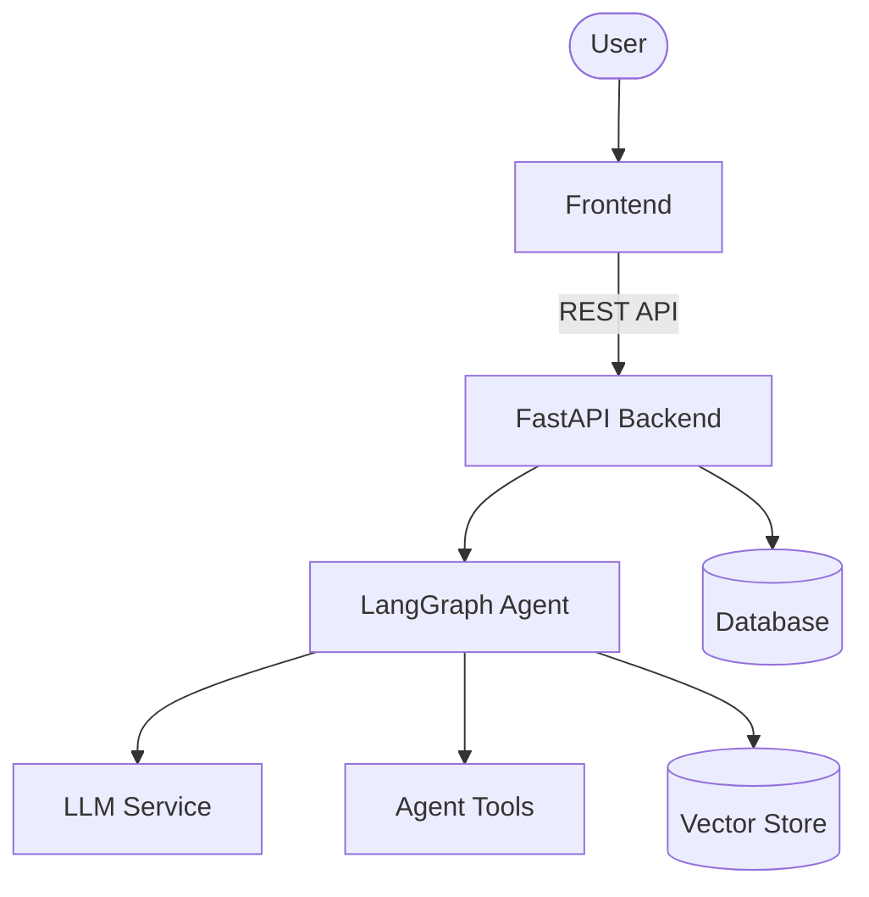
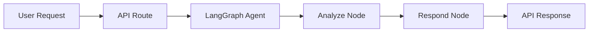

# Architecture

## System Overview

This project is structured as an AI agent application with a FastAPI backend,
a LangGraph-based agent layer, optional frontend UI, and supporting evaluation
and reporting artifacts.

## Main Components

| Component | Path | Purpose |
| --- | --- | --- |
| Backend API | `src/api/` | FastAPI routes and request handling |
| Agent | `src/agents/` | LangGraph state, graph, nodes, tools, and prompts |
| Services | `src/services/` | LLM, RAG, embedding, monitoring, and business logic |
| Models | `src/models/` | Pydantic request and response schemas |
| Repositories | `src/repositories/` | Database access layer |
| Frontend | `frontend/` | User-facing web application |
| Reports | `reports/` | Weekly, evaluation, and final reports |
| Evaluation | `eval/` | Test datasets, metrics, and evaluation outputs |

## Backend Flow

## Notes

- `src/` is the backend source code.
- `frontend/` is separated so Node.js dependencies and frontend deployment stay independent from Python backend code.
- `reports/weekly/` is the single place for weekly team reports.
