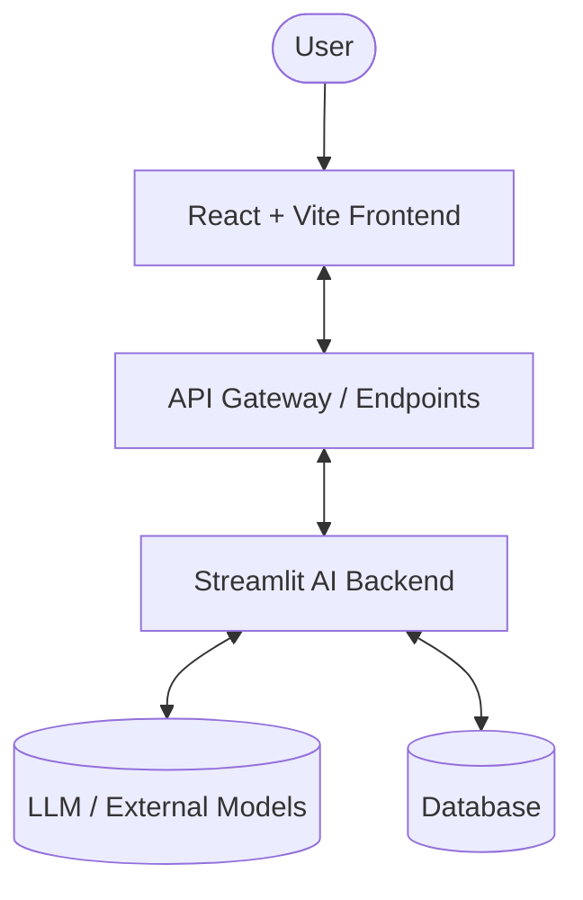
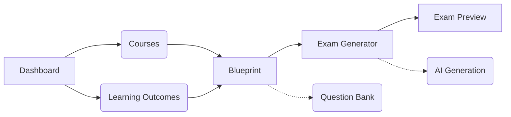
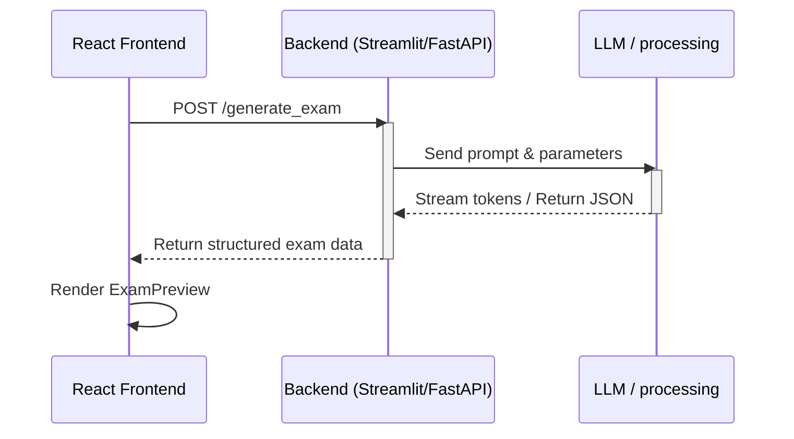

# Exam Generator Platform

A comprehensive platform designed to streamline the creation of exams and assessments. The system uses a modern React frontend and leverages a Streamlit-powered AI backend for intelligent content generation.

## System Architecture

The project is split into two primary layers:

- **Frontend (React + Vite):** Handles the user interface, routing, and user interactions.
- **Backend AI Layer (Streamlit):** Serves as an interactive and scalable environment for running complex AI workflows (like LLM-based test generation) alongside data processing.



## Technology Stack

- **Frontend:** React, React Router, Vite, Tailwind CSS, Radix UI (for accessible components).
- **Backend / AI Layer:** Streamlit, Pandas, LangChain, FastAPI (optional for structured API routes).
- **Language:** TypeScript / Python.

## Folder Structure

```
C2-App-141/
Γö£ΓöÇΓöÇ backend/                  # Streamlit application
Γöé   ΓööΓöÇΓöÇ app.py                # Entrypoint for the AI Layer
Γö£ΓöÇΓöÇ frontend/                 # React application
Γöé   Γö£ΓöÇΓöÇ public/               # Static assets
Γöé   Γö£ΓöÇΓöÇ src/
Γöé   Γöé   Γö£ΓöÇΓöÇ app/              # React App setup (Router, Layouts)
Γöé   Γöé   Γöé   Γö£ΓöÇΓöÇ components/   # Reusable UI components
Γöé   Γöé   Γöé   Γö£ΓöÇΓöÇ pages/        # Page components corresponding to routes
Γöé   Γöé   Γöé   ΓööΓöÇΓöÇ routes.tsx    # Route definitions
Γöé   Γöé   Γö£ΓöÇΓöÇ styles/           # Global styles and tailwind configs
Γöé   Γöé   ΓööΓöÇΓöÇ main.tsx          # React application entrypoint
Γöé   Γö£ΓöÇΓöÇ package.json          # Frontend dependencies
Γöé   ΓööΓöÇΓöÇ vite.config.ts        # Vite configuration
Γö£ΓöÇΓöÇ requirements.txt          # Python dependencies for the backend
ΓööΓöÇΓöÇ README.md                 # This file
```

## Frontend Architecture & Routing

The frontend uses `react-router` for declarative routing. 

### Page Routes:

- `/dashboard`: Main dashboard summary.
- `/courses`: Course management and lists.
- `/learning-outcomes`: Manage specific learning outcomes.
- `/blueprint`: Defines the structural layout of the exams (formerly `/exam-blueprint`).
- `/ai-generation`: Bulk/AI generation configurations.
- `/question-bank`: Search and manage the bank of available questions.
- `/exam-generator`: Interactive exam creation step-by-step.
- `/exam/:id/preview`: Preview a generated exam before publishing.
- `/review`: Peer review functionality.



## Frontend-to-Backend Communication Flow

The frontend currently uses asynchronous fetch calls (or specific integration points) to query the Streamlit backend layer.



## Setup & Installation

### 1. Backend (Streamlit) Setup

Ensure you have Python 3.10+ installed.

```bash
# Navigate to the project root
cd C2-App-141

# Create and activate a virtual environment (recommended)
python -m venv .venv
source .venv/Scripts/activate  # On Windows: .venv\Scripts\activate

# Install dependencies
pip install -r requirements.txt
```

### 2. Frontend (React) Setup

Ensure you have Node.js (v18+) and npm installed.

```bash
# Navigate to the frontend directory
cd frontend

# Install dependencies
npm install
```

## Running the Application

For local development, you need to run both servers concurrently in separate terminals.

### Run the Frontend

```bash
cd frontend
npm run dev
# The application will be available at http://localhost:5173
```

### Run the Backend

```bash
# From the project root, ensure your virtual env is active
streamlit run backend/app.py
# The Streamlit application will be available at http://localhost:8501
```

## Environment Variables

Create a `.env` file in the project root to configure sensitive variables (refer to `.env.example` if available).

```env
OPENAI_API_KEY=your_api_key_here
```

## Architectural Decisions & Implementation Rationale

1. **React + Vite:** Chosen for fast development speeds and HMR, ensuring quick feedback loops.
2. **Streamlit Backend:** Enables rapid prototyping of AI features and data processing tools, easily accessible via Python ecosystem without excessive boilerplate.
3. **Component-Based UI:** Encourages high reusability (via Radix UI components imported from Figma), providing a consistent user experience.
